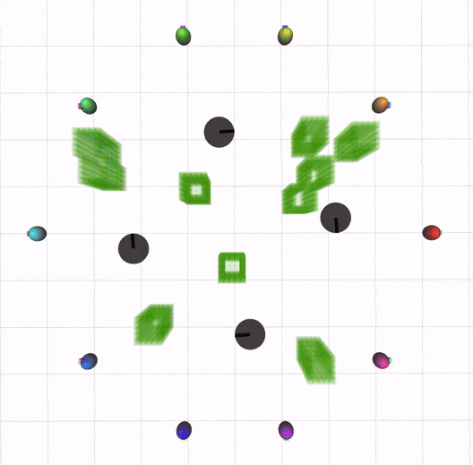

# dlsc_gc_planner

This package presents the source code of "Decentralized Trajectory Planning for Quadrotor Swarm in Cluttered Environments with Goal Convergence Guarantee".

- **Authors:** Jungwon Park ([LARS](https://lars.seoultech.ac.kr/), SeoulTech), Yunwoo Lee, Inkyu Jang, and H. Jin Kim ([LARR](http://larr.snu.ac.kr/), Seoul National University)
- **Paper:** [IJRR](https://journals.sagepub.com/doi/full/10.1177/02783649241312352)
- **Video:** [Youtube](https://youtu.be/AH_L9LO-arU?si=Xp28KLiMbtH0aS3a)


 


## 1. Install
This work is implemented based on C++17. Tested in the ROS Melodic, Ubuntu 18.04

(1) Install ROS Melodic for Ubuntu 18.04 or ROS Noetic for Ubuntu 20.04 (See http://wiki.ros.org/ROS/Installation, desktop-full version is recommended)

(2) Install CPLEX (https://www.ibm.com/products/ilog-cplex-optimization-studio)

(3) Set ROS distro

- ROS Melodic
```
export ROS_DISTRO=melodic
```
- ROS Noetic
```
export ROS_DISTRO=noetic
```

(4) Install dependancies and clone packages
```
sudo apt-get install ros-$ROS_DISTRO-octomap
sudo apt-get install ros-$ROS_DISTRO-octomap-*
sudo apt-get install ros-$ROS_DISTRO-dynamic-edt-3d
cd ~/catkin_ws/src
git clone https://github.com/qwerty35/dlsc_gc_msgs.git
git clone https://github.com/qwerty35/dlsc_gc_planner.git
```

(5) Before building packages, check CMAKELIST that CPLEX_PREFIX_DIR is indicating the intallation location. For instance, if CPLEX is installed in ```/opt/ibm/ILOG/CPLEX_Studio2211```, then CPLEX_PREFIX_DIR should be:
```
set(CPLEX_PREFIX_DIR /opt/ibm/ILOG/CPLEX_Studio2211)
```

(6) Build packages
```
cd ~/catkin_ws
catkin_make
source ~/catkin_ws/devel/setup.bash
```

## 2. Demo
- Run single mission
```
source ~/catkin_ws/devel/setup.bash
roslaunch dlsc_gc_planner simulation.launch
```
- Run 3D simulation in empty spaces sequentially
```
source ~/catkin_ws/devel/setup.bash
roslaunch dlsc_gc_planner testall_DLSCGC_empty.launch
```
- Run 2D simulation in obstacle environments sequentially
```
source ~/catkin_ws/devel/setup.bash
roslaunch dlsc_gc_planner testall_DLSCGC_2D.launch
```
- Run 3D simulation in obstacle environments sequentially
```
source ~/catkin_ws/devel/setup.bash
roslaunch dlsc_gc_planner testall_DLSCGC_3D.launch
```
The simulation result will be saved at ```dlsc_gc_planner/log```.

## 3. Configuration
You can configure the simulation setting at the launch, mission files.
- ```launch/simulation.launch```: Mission, octomap, parameters for algorithm
- ```missions/*.json```: Start, goal, dynamical limits of the agent, map size

See the comments in the ```launch/simulation.launch``` and ```missions/readme.txt``` file for more details

Note: If you want to generate the mission file automatically, then use the matlab script in ```matlab/mission_generator```

## 4. Acknowledgment
This work is implemented based on the following packages.

(1) PIBT (https://github.com/Kei18/mapf-IR)

(2) rapidjson (https://rapidjson.org/)

(3) openGJK (https://www.mattiamontanari.com/opengjk/)

(4) convhull_3d (https://github.com/leomccormack/convhull_3d)
